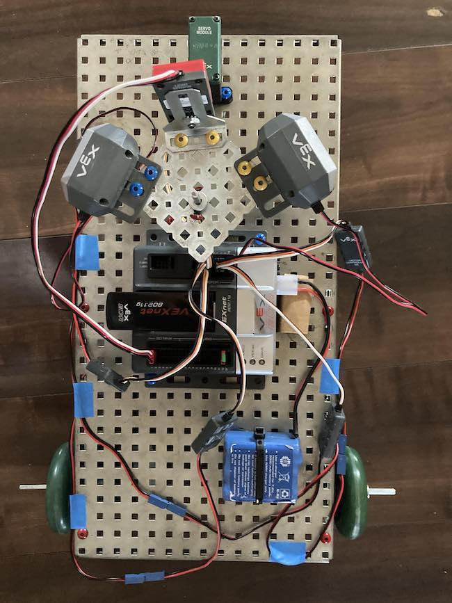
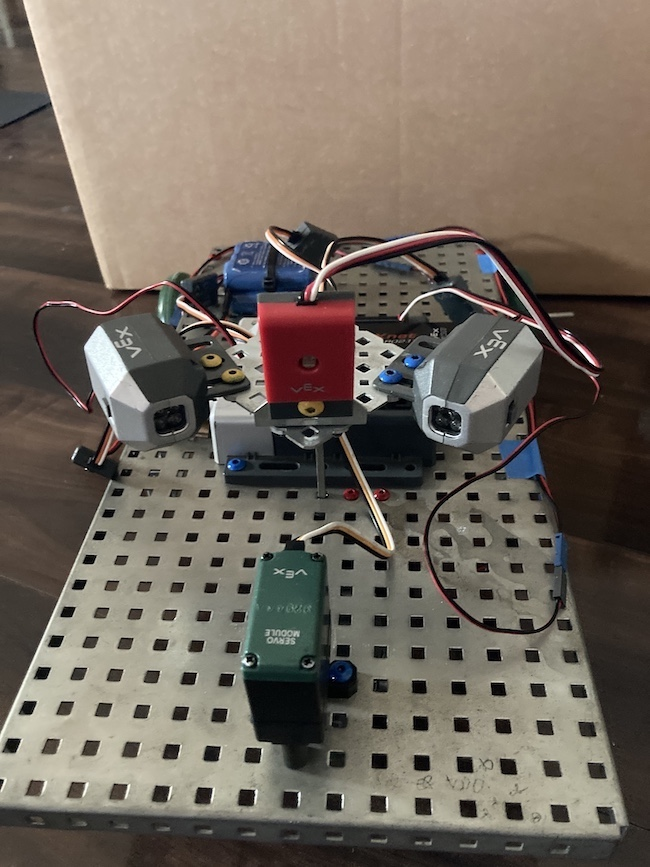
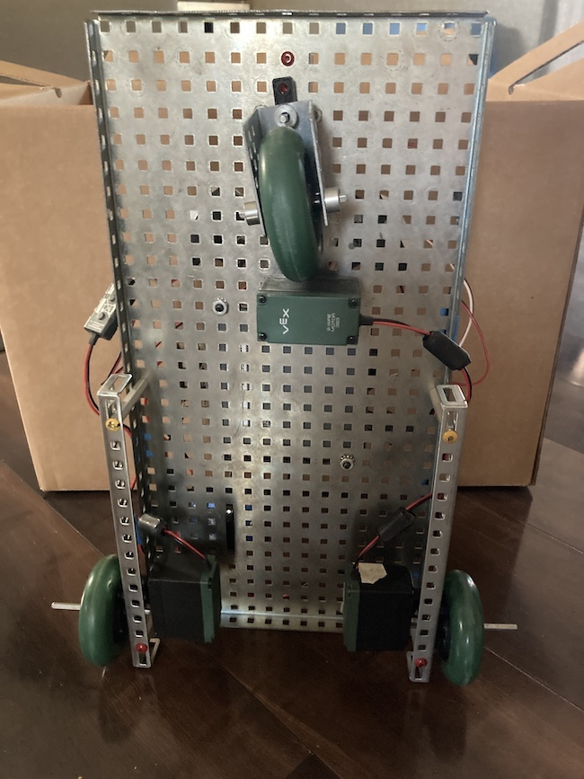
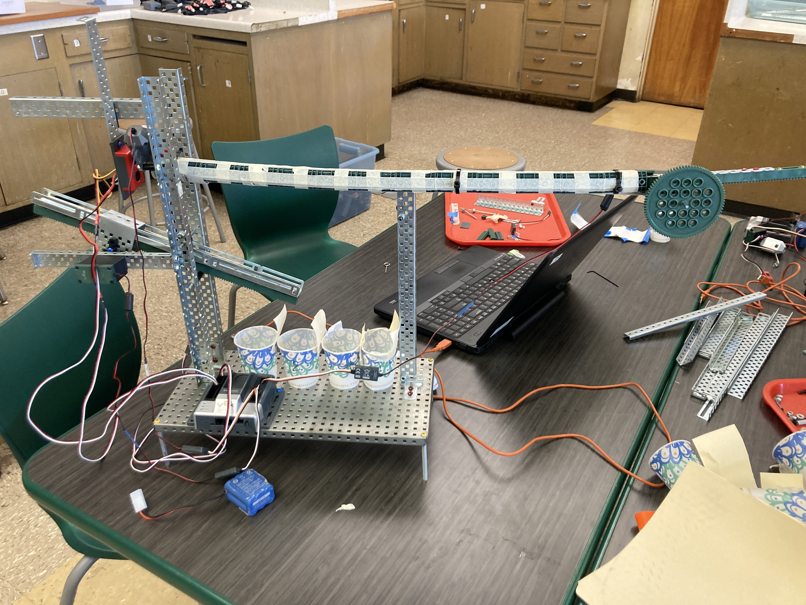

# pltw-robotics
Project Lead The Way robotics projects  
## Searchlight
The Spotlight Sidekick is changing Hide-and-Seek in the dark by adding a seeker's aide. Its headlights cut through the darkness, the hiders growing anxious as the wheels' mechanical whir and spotlights sweep closer and closer. Its lights flash upon a hider's discovery, as if to say, "Got you!" The hunted becomes the hunter as control is given to the one found. It is programmed with ROBOTC, a special type of C language used specifically for VEX Robotics parts. Collaborative project with Pedro Aguilar. 

  
  
  

## Marble Sorter
This project was worked on with Pedro Aguilar, used ROBOTC, and VEX Robotics parts. The machine is designed to sort forty assorted size wood, glass, opaque white plastic, and metal marbles (10 of each type). A push rod and rangefinder work together to push one marble into position to be scanned by flashlight and light sensor. A ramp on a motor extends the ramp based on the marble type to drop it into the correct cup.

  

## References
- [ROBOTC](http://cmra.rec.ri.cmu.edu/products/teaching_robotc_tetrix/fundamentals/introtoprogramming/documents/Fundamentals_ROBOTC.pdf)
- [VEX Robotics](https://www.vexrobotics.com/robotc-vexedr-vexiq.html#hyeesov)